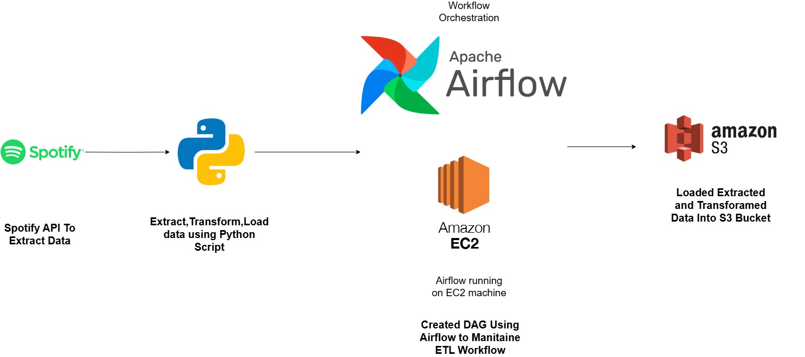

# Spotify Music Data Into S3 Bucket By Using ETL Data Pipeline with Apache Airflow
## Project Overview
This project demonstrates an **ETL (Extract, Transform, Load)** pipeline built using **Apache Airflow**, which automates the process of extracting data from the **Spotify API**, transforming the data with **Python**, and loading it into an **S3 bucket** for storage. The pipeline is scheduled and managed using **Airflow DAGs**.

## Key Features:
- **Extracts data** from Spotify API, including data such as songs, albums, or playlists.
- **Transforms the data** into the desired format (e.g., CSV or JSON) using custom Python scripts.
- **Loads the transformed data** into an S3 bucket for further analysis or use.
- **Orchestrates the entire ETL workflow** using Apache Airflow for scheduling and automation.

## Architecture:

## Technology Used:
1.Programming Language - Python

2.AWS Cloud Service Platform
  - EC2 Instance
  - S3 Bucket

3.Apache Airflow(Workflow Orchestration)

## Installation

### Prerequisites
1. Python Interpreter
2. Apache Airflow 
3. Spotify API
   -Make One API Using This Link-***https://developer.spotify.com/dashboard***
4.AWS Account

## Steps to Set Up
**1.Spotify API**

-Create Spotify Account And Login to https://developer.spotify.com/dashboard.

-Create App add name,redirect url and setup app.

-Then get Client ID,Client secret It use to Authenticate Spotify API to fetch Data.

**2.EC2 Instance**

-Go to AWS login to console.

-Make EC2 Instance and Connect to It and Run Following Commands To setup EC2.

-Commands:

 -sudo apt-get update
 
 -sudo apt install python3-pip 
 
 -sudo pip install apache-airflow
 
 -sudo pip install pandas
 
 -sudo pip install s3fs
 
 -sudo pip install spotipy

 **3.Start Apache Airflow**

-Run the Command on ec2 instance **airflow standalone**

-This will setup Airflow and get username and password and airflow running on by default port.

-Login to airflow uisng username and password and get access to dashboard.

**4.Make Dag Directory Inside Airflow Directory**

-In EC2 instance in Terminal check for airflow directory and change to that directory by **cd airflow**

-Inside airflow Directory make one new Directory called **spotify_dag** by using **mkdir spotify_dag** 

-Now, In airflow directory there is one file called **airflow.cfg** edit that file using **sudo nano airflow.cfg** by this we get edit window to edit file in this change dag directory name by our dierectory **dag's folder = /home/ubuntu/airflow/spotify_dag** and save it by **ctrl+x**.

**5.Write Python Script For ETL**

-By **cd spotify_dag** this we change the directory to spotify_dag.

-Now create ETL creation python script by **sudo nano spotify_etl.py** by this we get nano editor here we write code for ETL operations and here in this For load opertion we need to create on s3 bucket to store data

 -Makae s3 bucke give name to bucket **spotify_top_100_tracks** and use this name in python script to set loading path 

 -For example **album_df.to_csv("s3://spotify_top_100_tracks/name_it_to_csv_file.csv") this will load the data to s3 bucket.

**5.Write Python Script For DAG Creation**
 **DAG** stands for **Directed Acyclic Graph**. It's a collection of tasks with specific dependencies, organized in a way that represents a workflow. Each task in the DAG represents a single unit of work, and the DAG itself defines the order in which those tasks should be executed.

 -Now create DAG creation python script by **sudo nano spotify_Dag.py** by this we get nano editor here we write code for DAG operations.

**6.Run The DAG to perform and Maintain ETL Data Pipeline Flow**

-Once we created **spotify_etl.py** and **spotify_Dag.py** this two file are in **spotify_dag** 

-Now Again start the airflow by **airflow standalone** and login to airflow using username and password.

-Now in airflow Dashboard we can see the DAG **spotify_dag** cilck on it

-After Click on that you will get DAG operations like grpah,code,task duration etc, Click on **graph**

-here graph is maintain etl data pipeline

-Now Click on Run , by this It Run the DAG and According to python script execute Task and Maintain ETL pipeline until data is load to S3 buket.

-Once DAG see in Green colour and show Success message Means our Data Pipeline is executed successfully.

-Go to S3 bucket here you get loaded CSV File of Data.

 

 

 
 

